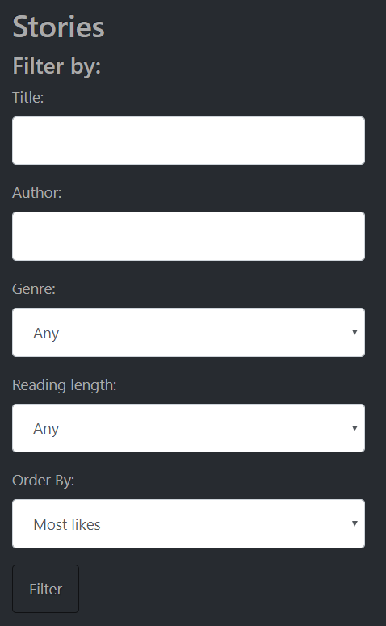

# ASP.NET Core Story Website
A website built with ASP.NET Core 2.1 using SQL Server where users can read and write stories.

# Table of Contents
### 1. Introduction
   * **1.1.** Brief Summary
   * **1.2.** How to Run the App

### 2. Database Model

### 3. Page Walkthrough
   * **3.1.** Home Page
   * **3.2.** Story Search Page
   * **3.3.** Writer Search Page
   * **3.4.** Write Story Page
   * **3.5.** Profile Page
   * **3.6.** Account Page
   * **3.7.** Register Page
   * **3.8.** Sign In Page
   
### 4. Additional Details

# 1. Introduction

## 1.1. Brief Summary
Users may read stories and browse through writer profiles without creating an account. In order to write or like stories and follow other writers, users must register or sign in with an account and create a profile.

## 1.2. How to Run the App
**1.** Make sure you have ASP.NET Core (version 2.1 or newer) along with SQL Server and NuGet.

**2.** Build the solution in Visual Studio. Then run it on your local server (such as IIS Express). The database along with all sample data will be migrated and seeded automatically.

**3.** You can sign in with one of the sample accounts (sign in details are displayed in the sign in page) or register a new one.

# 2. Database Model

**Account (AspNetUsers)** - Associated with the user's sign in and contact details.

**Profile** - Enables users to: display a public profile, follow and be followed by other profiles and to write and like stories.

**FollowerList** - Stores a pair of profile ID's, signifying a "following" and "followed by" relationship between profiles.

**Story** - Is written by a profile. 

**LikeList** - Stores a pair of one profile ID and one story ID, signifying a "likes" and "liked by" relationship between a profile and a story.

# 3. Page Walkthrough

## 3.1. Home Page

A simple landing page with a static picture and some text.

## 3.2. Story Search Page

A page containing a sorting filter and along with all the stories in the database. Users may filter stories based on title, author, genre and estimated reading length. They may also order stories by most likes, least likes, newest post date or oldest post date.

## 3.3. Writer Search Page

A page allowing users to search for writers by name. Users may also sort writers by most followers, least followers, newest join date and oldest join date. If the user is signed in, they may follow or unfollow writers directly from this list.

## 3.4. Write Story Page

A page allowing signed in users to write and post stories. Stories contain a title, genre and content.

## 3.5. Profile Page
A profile page is associated with the user's public profile. It contains four parts which can be toggled asynchronously via the side navigation bar. If the user is viewing another user's profile, the option to follow or unfollow the profile appears. If the user is viewing their own profile, the option to edit their profile appears.

### 3.5.1. Profile's Stories Page

A list of all the stories the profile has written.

### 3.5.2. Profile's Biography Page

The profile's biography.

### 3.5.3. Profile's Followers Page

A list of all the users following the profile.

### 3.5.4. Profile's Liked Stories Page

A list of all the stories that the profile has liked.

## 3.6. Account Page
An account page is associated with the user's private sign in information. It contains three parts which can be toggled asynchronously via the side navigation bar.

### 3.6.1. Account's Contact Information Page

Allows users to change their email address and phone number.

### 3.6.2. Account's Password Page

Allows users to change their password.

### 3.6.3. Account's Data Page

Allows users to delete their account (which would also delete their public profile and their stories) or to download a JSON file of their account and profile information.

## 3.7. Register Page

Allows users to register an account.

### 3.7.1. Create Profile Page

Upon registering for an account, users will immediately be prompted to create their profile before they begin using the website. It is not mandatory that they do this right away

but they will need to do it eventually if they wish to write or like stories and follow or be followed by other users.

## 3.8. Sign In Page

Allows users to sign in. Sample seeded account email and password details are displayed for demonstration purposes.

## 4. Additional Details

The profile page and the account page are both using Razor Page (MVVM) architecture, while the remainder of the pages use traditional MVC architecture.

The website design uses Bootstrap 4 and is from: https://bootswatch.com/slate/. A couple of custom CSS additions were made (story content text, etc).

